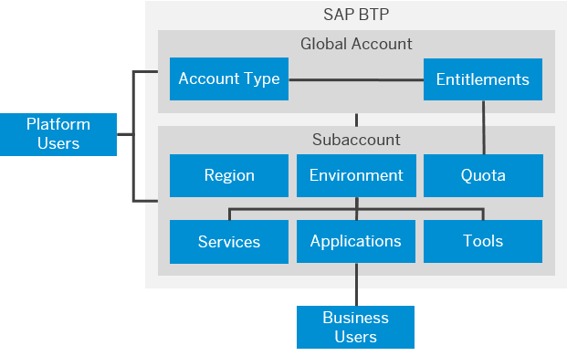
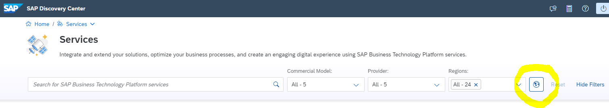

## Understand Global Accounts and Subaccounts

### Global Account

An SAP BTP global (enterprise) account is the realization of a contract you made with SAP. Global accounts are region- and environment-independent. After successful first login, you will land on your global account home page.

- A global account is either of the account type **enterprise** or **trial** (a limited single-user account).

- A global account is used to manage **global account members** (typically for managing the global account), **entitlements** and regional **subaccounts.**

- A global account can contain one or more subaccounts in which you run applications and services.

 

#### Entitlements of your Global Account

When you purchase an enterprise account, you’re entitled to provision and consume resources, such as a set of BTP services and the amount of resources they may consume. 

**[Entitlements](https://help.sap.com/docs/BTP/65de2977205c403bbc107264b8eccf4b/c8248745dde24afb91479361de336111.html?locale=en-US)** are purchased and managed at the global account level, from where they are distributed to subaccounts with, which consume them.

The amount of resources you may consume are defined in the **Service Plans** of a BTP service. For example, [SAP BTP, Cloud Foundry Runtime](https://discovery-center.cloud.sap/serviceCatalog/cloud-foundry-runtime?region=all&tab=service_plan) offers in the commercial model CPEA the service plan "**Free**" with the limited resource of 4 GB memory to consume. The service plan "**Standard**" let you choose the amount of memory you want to consume.

Some BTP services need an explicit **"Quota"** for a subaccount, means a certain amount of the available entitlement is distributed to a specific subaccount.
When you remove quotas from a subaccount, they become available again at the global account level and can be assigned to other subaccounts.

  

### Subaccounts

All subaccounts in a global account are independent of each other. 
A subbaccount always belongs to one region and one provider running in that region. 

**Providers** are either SAP or our Infrastructure-as-a-Service (IaaS) partners Amazon Web Services (AWS), Microsoft Azure, Google Cloud Platform (GCP), and Alibaba Cloud. These providers operate the infrastructure layer of the regions, whereas SAP operates the platform layer and Cloud Foundry.

Depending on the provider they have a multi-cloud foundation with multiple **environments**, such as SAP BTP, Cloud Foundry, ABAP, and
Kyma with the recommended set of services.
If the provider is SAP, they have NEO environment with a limited set of services.

A subbaccount is used to manage **subaccount members**, **BTP services and applications** and their **quotas** (if required) and **tools** like the Business Application Studio.

They operate in different locations in the world, called **regions**. For more information, see [Discovery Center](https://discovery-center.cloud.sap/viewServices?provider=all&regions=all&showFilters=true). Click the small world icon in the filter bar.

 

#### Further information

SAP Help - [Basic Platform Concepts](https://help.sap.com/docs/BTP/65de2977205c403bbc107264b8eccf4b/73beb06e127f4e47b849aa95344aabe1.html?locale=en-US)

 
