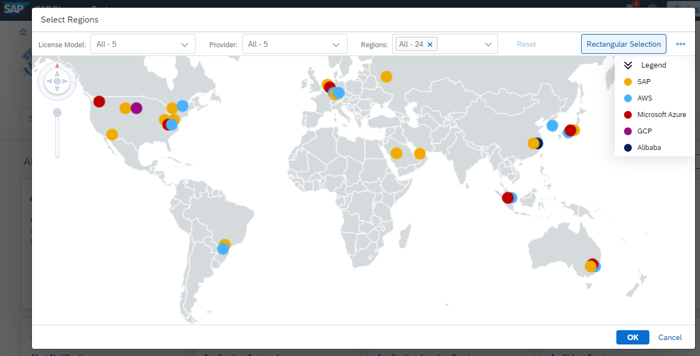

## Understand Regions, Provider and Environments

If you set up your SAP BTP you will have to make conscious decisions about 
* **Regions**  (towns in different locations)
* **Provider** (for the infrastructure).
* **Environments** (such as Cloud Foundry, ABAP, Kyma)
* **Services** which you want to run in this region, provider and environemnt

**Note:** Not all Services and Applications or Environments are available in all Regions and on all Providers. 
Different Providers, Environments and Regions may have a different set of available services.

 

### Region of the Subaccount

SAP BTP is available in many regions, that is data centers, around the globe. 
A region represents the physical location of a data center (for example, Europe, US East) where applications, data, or services are hosted.

A region will be chosen at the "subaccount" level. 
For each subaccount, you select exactly one region (that is one data center).

 

### Provider for the Infrastructure

Regions are provided either by SAP data centers or by our Infrastructure-as-a-Service (IaaS) partners Amazon Web Services (AWS), Microsoft Azure, Google Cloud Platform (GCP), and Alibaba Cloud. 
The third-party region providers operate the infrastructure layer of the regions, whereas SAP operates the platform layer and the environment.

You can check available Regions in advance on SAP Discovery Center - [Services](https://discovery-center.cloud.sap/servicessearch/ABAP/?provider=all&regions=all&showFilters=true) (click the small world icon in the filters bar)

 

As a result, you will see an overview map for Provider and Regions

 

### Environments of the Provider

The Provider determines the [environments](https://help.sap.com/docs/BTP/65de2977205c403bbc107264b8eccf4b/15547f7e7ecd47ee9fa052b0e18c7b0a.html?locale=en-US) you are able to run.

Infrastructure Provider such as AWS, Azure, GCP or Alibaba Cloud provide the [Multi-Cloud Foundation](https://help.sap.com/docs/BTP/b017fc4f944e4eb5b31501b3d1b6a1f0/06b6fb3d45d040429e36f0359d2fe1f2.html?locale=en-US) which comprises three different enviroments:

- Cloud Foundry environment, the runtime for many BTP services 
- Kyma environment, a Kubernetes runtime with serverless functions 
- ABAP environment

SAP data center provide the NEO environment with a limited set of services.

