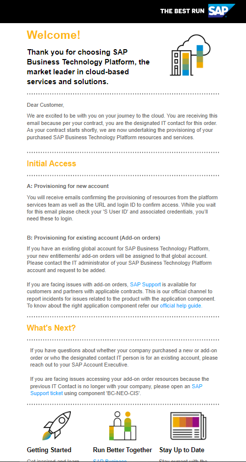
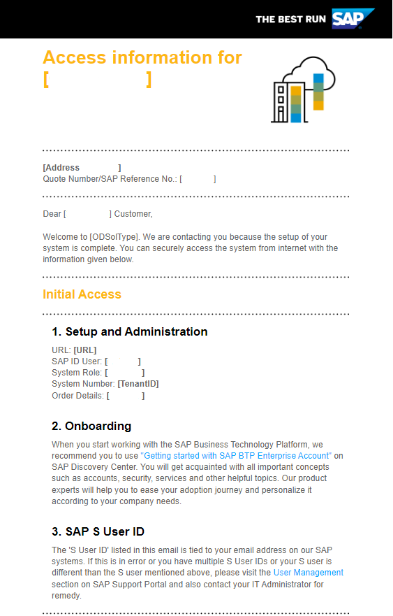

## Welcome to SAP BTP Enterprise Account! 

This mission guides you through your first steps on SAP BTP Enterprise Account:

1. Check your e-mails: the IT Contact names on the initial order for your SAP BTP tenant received the access and Logon information for your SAP BTP tenant
2. Your initial login to your Global Account
3. Add additional Global Administrators
4. Change the display name of your Global Account
5. Check your Entitlements for the Global Account
6. Creating sub-accounts

 

## 1. Check Your E-Mails

### Check your first mail: IT Contact for your SAP BTP tenant
While you get started with your BTP Account, this would be the very first step – a “ Welcome Email” will be sent once your account is getting ready to be provisioned from SAP (no.reply.provisioning@sap.com).

**Note:** This mail is sent to the IT Contact person of your company whose ID was provided during the contract signing process. The initial SAP BTP Global Account access is provided to only the IT Contact and it would be his/her responsibility to add additional Global Administrators and delegate the work as required. 

In case you are not the IT Contact person and have received the BTP login details from your Administrator, you can stop here and continue with the next steps. However, it would be good to understand the process.

The welcome email address sample is shown below:

 

### Check your second mail: Logon Information for your SAP BTP tenant

You will receive your second email from the platform services team shortly before the contract start date. Look for these emails for the confirmation of account setup and access.

It contains an **S-user**, which can also be used for SAP Store, SAP Support, SAP.com.

The S-user of the Global Account Administrator is attached to your licensed SAP BTP Global Account and your entitlements from your consumption or subscription license. You must log on with the correct URL and user credentials to Administrate your global account.

If you are working with many SAP solutions, you may want to check your assigned SAP S-Users (you might have more than one) independent from SAP BTP with [SAP ID Service](https://accounts.sap.com/).  

 

### SAP Support for Enterprise Accounts

#### How to change the Global Account Administrator for the SAP BTP? 

If you want to change this user,  create a ticket at the SAP Support Portal.  
Select the component **BC-NEO-CIS-OPS** (find guidance at help.sap.com: "Getting Support").

#### Support for S-User

In case you need support for your S-user for SAP ID service, you may create a ticket in the component **XX-SER-SAPSMP-USR** (SAP Support Portal - User Administration)

 
