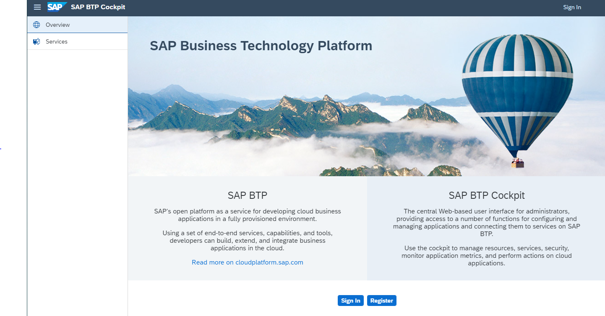
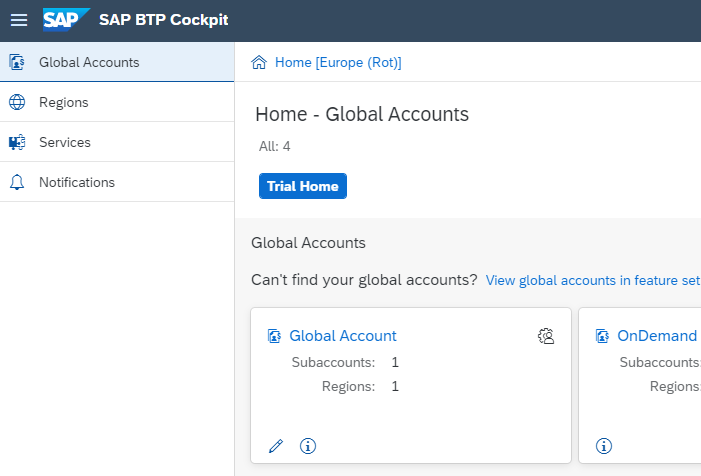

## Your initial login to your Global Account

Use the link from the email if it’s a first attempt to log into your BTP account, else you may use the direct link [SAP BTP Cockpit Home](https://account.hana.ondemand.com/#/home/welcome). 

**Note:** For the first login to SAP BTP Enterprise Accounts, it is important to log on with the Global Account Administrator credentials that you received in your e-mail. In case you are not an administrator, the best option is to contact your Administrators for access.

 

 

 

**Result:** You get forwarded to the SAP BTP Cockpit Home and see your Global Account(s):

 

 

To get an overall understanding of your **BTP Global Account Cockpit**, look at the blog [SAP BTP Cockpit – Global Account Technical Overview](https://blogs.sap.com/2022/01/04/sap-btp-onboarding-series-sap-btp-cockpit-global-account-technical-overview/).

 
