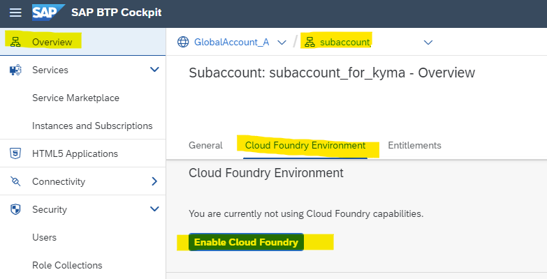
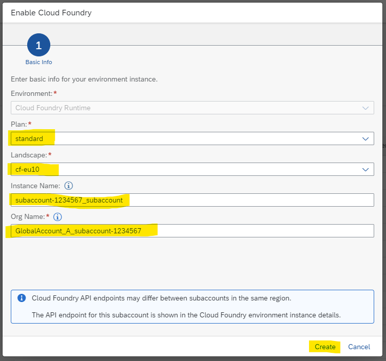
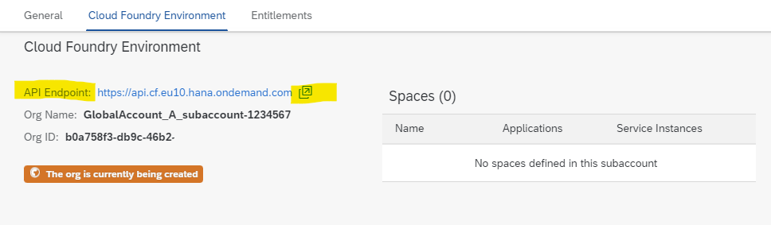
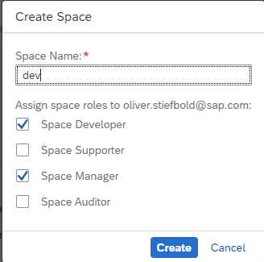
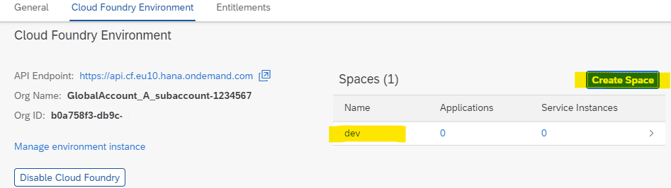

## Enable Cloud Foundry Environment in Your Subaccount

After you have created your subaccount you need to enable the runtimes of the subaccount.  
Runtimes can be either **Cloud Foundry, Kyma or ABAP**.  
In this tutorial you will enable **Cloud Foundry**.  
Guides fo the other runtimes can be found in dedicated tutorials or missions.

### Enable Cloud Foundry

1. Open your BTP Cockpit.
2. Select the subaccount, you just created.
3. Select **Cloud Foundry Environment** in the tab navigation.
4. Check the button `Enable Cloud Foundry`.

   

5. A form opens. Keep the preconfigured values or change the following entries: 
   * **Plan**: One of the Service Plans you are entitled to (e.g. standard, or free)
   * **Landscape**: Some Regions have more than one Landscape.
   * **Instance Name**: Consider a CLI-friendly name 
   * **Org Name**: Each Cloud Foundry environment has exactly one Organization.

   

6. Choose `Create`.
7. The Cloud Foundry Environment will be created.  
   Note your API Endpoint. Copy and call it in a browser. You will need it in other tutorials.  
   Note: You still have no "Spaces". You will need at least one.

   

### Create Spaces

After you have enabled Cloud Foundry runtime, you can create a space.  
There is no limit to how many spaces you can have within one org.
Spaces e.g. can be used to separate dev from test and prod environment.

1. In your subaccount overview page, choose "Cloud Foundry Environment" again.
2. Press the button `Create Space`.
3. A popup form opens.
4. Provide a name  (choose "dev" if you have no name)

   

5. Keep the **space roles** as preconfigured and choose `Create`.
6. Congratulations you now have a configured Cloud Foundry Environment.

For more information, see [Managing Spaces](https://help.sap.com/docs/BTP/65de2977205c403bbc107264b8eccf4b/managing-spaces?locale=en-US) on SAP Help Portal.

