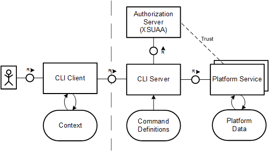

## Account Administration Using the SAP BTP Command Line Interface

The SAP BTP command-line interface (BTP CLI) can be used for all account administration tasks, such as creating or updating subaccounts, authorization management, and working with service brokers and platforms. 
It is an alternative to the SAP BTP cockpit for all users who prefer to work in a terminal or want to automate operations using scripts.

>Note: btp CLI is the command line tool of the BTP Platform. it does not include [Cloud Foundry CLI](https://developers.sap.com/tutorials/cp-cf-download-cli.html), which you need for the Cloud Foundry runtime, or the [Kyma CLI](https://kyma-project.io/docs/kyma/latest/04-operation-guides/operations/01-install-kyma-CLI) for Kyma runtime or Kubectl. 

### More information and Tutorials

* SAP Tutorial [Get Started with the SAP BTP Command Line Interface (btp CLI)](https://developers.sap.com/tutorials/cp-sapcp-getstarted.html)
* [Account Administration Using the SAP BTP Command Line Interface](help.sap.com/docs/btp/sap-business-technology-platform/account-administration-using-sap-btp-command-line-interface-btp-cli-feature-set-b?locale=en-US) on SAP Help Portal. 
 

 

You can download the btp CLI from the [SAP BTP Developer Tools page](https://tools.hana.ondemand.com/#cloud-btpcli).

 

### Automating the setup of your SAP BTP account with btp-setup-automator

SAP provides with the newly available GitHub repository for the [btp-setup-automator](https://github.com/SAP-samples/btp-setup-automator) the community a repository with **scripts to automate the setup of an SAP Business Technology Platform** (SAP BTP) account and to learn how this is done with the various command-line interfaces and tools.

The tooling for the btp-setup-automator is running within a Docker container and the repository provides all that you need. 

See also this [SAP blog](https://blogs.sap.com/2022/03/17/automating-the-setup-of-your-sap-btp-account-with-btp-setup-automator/) for further information.
