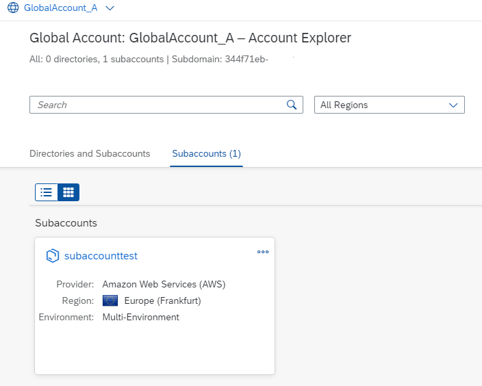

## Setup BTP CLI


To use the SAP BTP command line interface (btp CLI), you need to download the client first.

### Download btp CLI

1. Download the SAP BTP Command Line Interface (btp CLI) client for your operating system from SAP Development Tools or use the direct links to the latest version below. <br> 
   They are tar.gz archives that contain one executable file.
   * Search for "btp CLI" on "SAP Development Tools" (https://tools.hana.ondemand.com/#cloud-btpcli)
   * Direct link to lates windows archive (https://tools.hana.ondemand.com/additional/btp-cli-windows-amd64-latest.tar.gz) 
   
2. Extraxt the archive using tar. Get details of tar with `tar --help`. <br>
   The general command for extract is: `TAR -xf <archive-filename>` <br>
   For example in windows: `C:\> tar -xvf C:\TARS\btp-cli-windows-amd64-2.33.0.tar.gz`
   ```
   -x: Extract.
   -v: Verbose.
   -f: Filename.
   ````
 
 3. Add btp CLI to your system **environment variables** (e.g. PATH in windows) or work in the directory of the btp CLI.

For more information, see
* SAP Tutorial [Get Started with the SAP BTP Command Line Interface (btp CLI)](https://developers.sap.com/tutorials/cp-sapcp-getstarted.html)
* https://help.sap.com/docs/btp/sap-business-technology-platform/download-and-start-using-btp-cli-client

<br>

### First Commands with btp CLI

For your first commands with btp CLI, you need no connection to the BTP platform.
On Windows, open your `CMD` or Powershell terminal. Type

1. `btp --version`. Should be the version you just downloaded.

2. `btp --help` gives you more details on btp CLI commands:
    ``` 
    Usage: btp [OPTIONS] ACTION GROUP/OBJECT PARAMS

    Each GROUP contains multiple OBJECTS, on which you can perform ACTIONS.

    ACTIONS:
        list, get, create, update, delete, add, remove, assign, unassign, enable,
        move, register, unregister, subscribe, unsubscribe, share, unshare

    GROUPS:
        accounts  Objects related to the account model, subscriptions, and environments
        security  Authorization objects and users
        services  Objects related to SAP Service Manager

    Example help calls:
        btp help list                                 Commands for ACTION "list"
        btp help accounts                             Objects in GROUP "accounts"
        btp help accounts/available-environment       Actions for OBJECT "available-environment"
        btp help list accounts/available-environment  Command-specific help
        btp help all                                  Overview of all commands

   General actions:
        help                  Display help
        feedback              Give us feedback
        login                 Log in to a global account of SAP BTP
        logout                Log out from SAP BTP
        target                Set the target for subsequent commands
        enable autocomplete   Enable command autocompletion
        disable autocomplete  Disable command autocompletion

   Options:
       --config   Specify location of configuration file
       --format   Change output format (valid value: json)
       --help     Display help
       --info     Show version and current context
       --verbose  Print tracing information for support
       --version  Print client version

3. `btp --info`. Gives you some informations about fundamental configurations, like:
    ```
    Usage: btp [OPTIONS] ACTION GROUP/OBJECT PARAMS
    CLI server URL: https://cpcli.cf.eu10.hana.ondemand.com (server v2.38.1) (central CLI API, preconfigured)
    Configuration: (<your local folder>/config.json)
    ``` 
    
For more information see [btp CLI Command Reference](https://help.sap.com/docs/btp/btp-cli-command-reference/btp-cli-command-reference). 


### Log-in


>Your global account must be on feature set B. <br>
>Your user is assigned to the Global Account Viewer or the Global Account Administrator role collection. <br>
>When you log in to your global account with the btp CLI, a token is created and stored on your computer that allows to close and reopen the command line without losing your login. With each command call, this token is renewed and valid for 24 hours. 

For more information, see [SAP HelpPortal](https://help.sap.com/docs/btp/sap-business-technology-platform/log-in)

<br>

#### Login with User and Password

1. Type `btp login` <br>
2. Enter `CLI server URL`. https://cpcli.cf.eu10.hana.ondemand.com is preconfigured. Accept with "enter" or provide a different server URL from your operator.
3. Enter `User`. The email adress for your BTP platform
4. Enter `Password`. Your password for your BTP platform
5. The result is for example (in case you have 3 Global Accounts):

   ```
   Authentication successful 

   Choose a global account:
      [1]  12345678trial
      [2]  GlobalAccount_A
      [3]  GlobalAccount_B
   Choose option>
   ```
6. Choose option, e.g. `2`. The result is e.g. on Windows:

   ```
   Current target:
   GlobalAccount_A (global account, subdomain: 1234567-8910-11....)

   We stored your configuration file at: C:\Users\<username>\AppData\Roaming\SAP\btp\config.json
   Microsoft Windows: C:\Users\<username>\AppData\Roaming\SAP\btp\config.json
   To change this location, use the --config option or the environmnet variable
   ```

<br>

#### Login with Single Sign On


1. Type `btp login --sso`
2. Enter "CLI server URL". Use preconfigured URL [https://cpcli.cf.eu10.hana.ondemand.com] or enter your own.
3. A browser popup windows will open. Confirm login.

   

4. The result is for example (in case you have 3 Global Accounts):

   ```
   Authentication successful 

   Choose a global account:
      [1]  12345678trial
      [2]  GlobalAccount_A
      [3]  GlobalAccount_B
   Choose option>
   ```
   
5. Choose option, e.g. `2`. The result is e.g. on Windows:

   ```
   Current target:
   GlobalAccount_A (global account, subdomain: 1234567-8910-11....)
   ```

<br>

### Change your btp target

Commands are executed in the **target**, unless specified otherwise using a parameter. To change the target, use `btp target`. <br>
In this example you choosed as target "GlobalAccount_A". <br>
If you want to change your target, type

1. `btp target`

2. the result is for example:
   ```
   Choose subaccount or directory:
     [..]  Switch Global Accounts
      [.]  GlobalAccount_A (global account)
      [1]  └─  subaccounttest (subaccount)
   Choose, or hit ENTER to stay in 'GlobalAccount_A' [.]>
   ```

3. Type `..` to get a global account list, where you can choose your new global account.
  
<br>

### Logout

To log out, type

1. `btp logout`.

This terminates your active logout session and ensures that all user-specific data is removed. The next time you log in, you will have to type in the subdomain of the global account and your user.

  

## Create a Subaccount with btp CLI


1. Check the details of your global account. Type `btp get accounts/global-account`.
2. Check existing subaccounts of your global account. Type `btp get accounts/global-account --show-hierarchy`.
3. Get help for btp create command. Type `btp --help create`
4. Optional, get detailed help. Type `btp --help create accounts/subaccount`
5. Get help about the available regions. Type `btp list accounts/available-region`.

6. Now as you have the required infos, create the subaccount. <br>
   For exmaple, choose **subaccounttest** as display-name and **eu10** as region (this will be Frankfurt). <br>
   As subdomain, you may choose **mysubdomain12345**.Must be unique within the defined region. 
   
   `btp create accounts/subaccount --display-name subaccounttest --region eu10 --subdomain mysubdomain12345`

7. The result is
   ```
   Creating a subaccount in <your global account ID>...

   subaccount id:         <your ID for the subaccount>
   technical name:        N/A
   display name:          subaccounttest
   description:
   subdomain:             mysubdomain12345
   region:                eu10
   created by:            <your user email>
   beta-enabled:          false
   used for production:   false
   parent id:             <your ga ID>
   parent type:           global account
   state:                 Started

   Command runs in the background.
   Use 'btp get accounts/subaccount' to verify status.

   OK
   ```   
  
8. Check your subaccounts. <br>  
   In terminal, type: `btp list accounts/subaccount`
   It will list the subaccounts in your global account. Or
   
9. Open your global account in BTP Cockpit an check your new subbaccount:

   

<br>

Congratulations! You made your first steps with btp CLI.

For further information, see [Working with Global Accounts, Directories, and Subaccounts Using the btp CLI](https://help.sap.com/docs/btp/sap-business-technology-platform/working-with-global-accounts-directories-and-subaccounts-using-btp-cli?locale=en-US).

