## Use a Booster for creating a Subaccount with an ABAP Environment

A Subaccount in a SAP BTP Global Account is the place where you run your BTP services. You need at least one.  

While you are getting started, an administrator needs to set up your subaccount for development activities.  
These activities could be achieved manually, however, BTP offers automation on the standard approach known as **“Booster”**.   
A booster is a wizard-based step-by-step BTP cockpit UI for achieving defined tasks in configuration. 

### Check your Global Account Entitlements for ABAP

First, before you run the booster, check that your Global Account is entitled for the ABAP Environment.  
In your Global Account, navigate to Entitlements --> Service Assignements.  
Search for "ABAP" to reduce the list.  
Make sure you are entitled and have free, unused Quota:

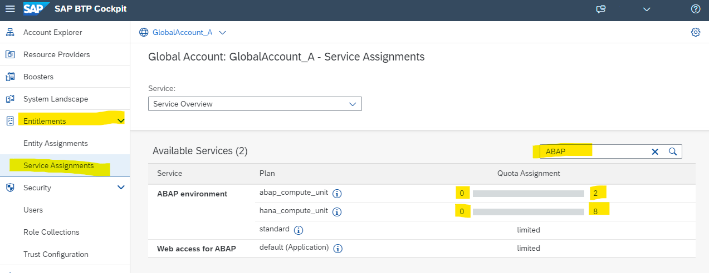

### Find Boosters in Cloud Cockpit

You can find boosters under the navigation entry "boosters" in your global account.

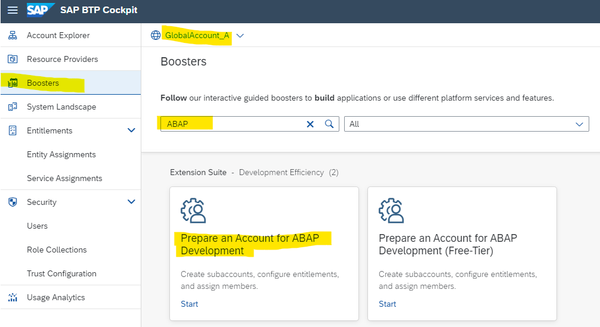

 

### Choose Booster "Prepare an Account for ABAP Development”

In this mission, we are using the booster **"Prepare an Account for ABAP Development”** which helps you to create a Cloud Foundry subaccount for developing ABAP applications.

Step by step, the booster assigns a curated set of entitlements, creates a subaccount, configures services, and sets up authorizations. 

In the background, it enables Cloud Foundry, creates default space, and assigns users to specific roles.

In the boosters overview, select the booster "Prepare an Account for ABAP Development", read the "Overview" description, and check the required "components". Entitlement of "Cloud Foundry Runtime" is required, which means your Global Account is entitled to use Cloud Foundry runtime. 

Press **"Start"** to start the booster.

 

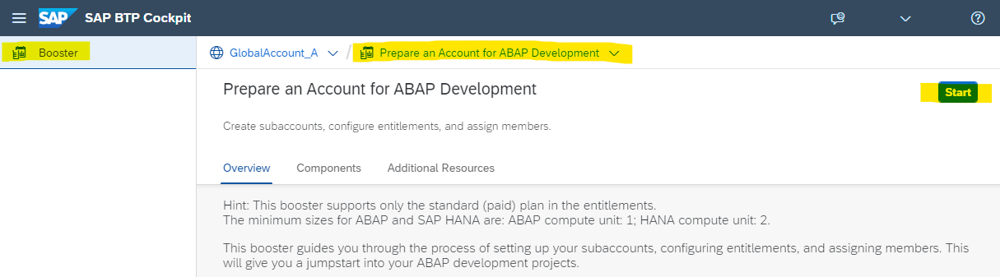

 

### Fill out the Booster form

#### Step 1 - Check Prerequisites

The prerequisites will be checked.   
If the boosters fails, it will tell you what is missing:

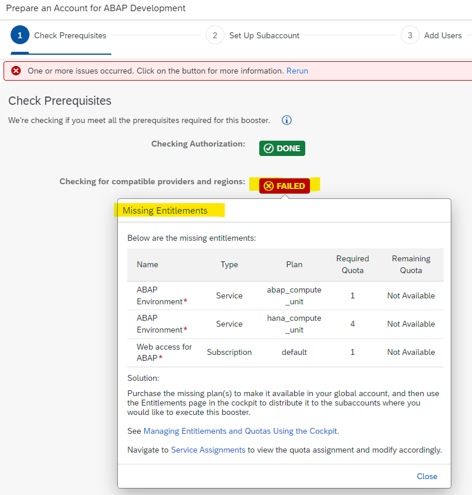

If the check is marked as green - authorizations and entitlements are fulfilled. Click "Next" to continue.

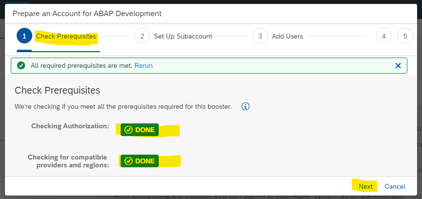

#### Step 2 - Set Up Subaccount

**Provide:**

1. Entitlements
   See the picture for minimum set-up. Note: you need at least 4 units Quota for **hana_compute_unit**.

2. A subaccount name of your choice.
3. Provider (Note: Only multi-cloud providers support Cloud Foundry runtime. SAP Data Center cannot be selected).
4. Region (Typically near your location)
5. Subdomain (Note: Subdomain name is used as URL access and it cannot be changed once created).
6. Org name of your choice
7. and Space name (typically DEV, TEST, or PROD)

and then click on **"Next". **

 

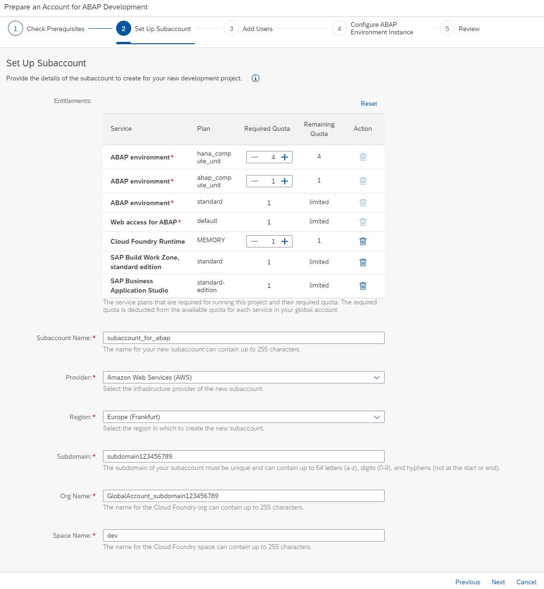

 

#### Step 3 - Add Users

Provide subaccount admin users and the developers who will be accessing the system. Click on Next.

 

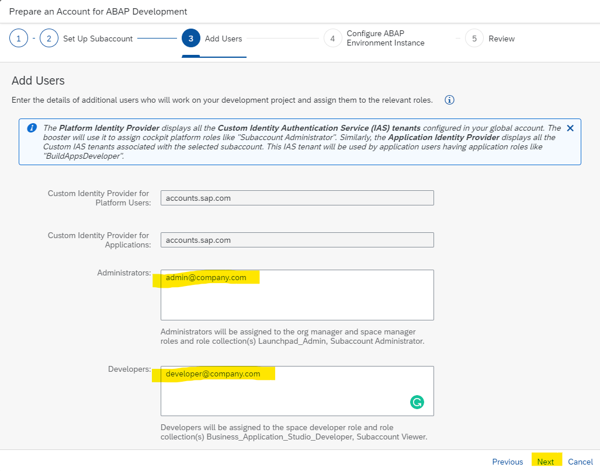

 

#### Step 4 - Configure ABAP System ID

Must be 3 Capital Letters or Digits. Choose "Next".

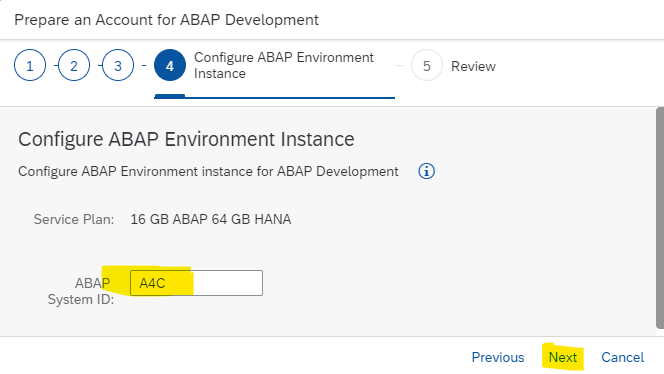

#### Step 5 - Review

Check the summary of the subaccount details before you execute the booster.
 

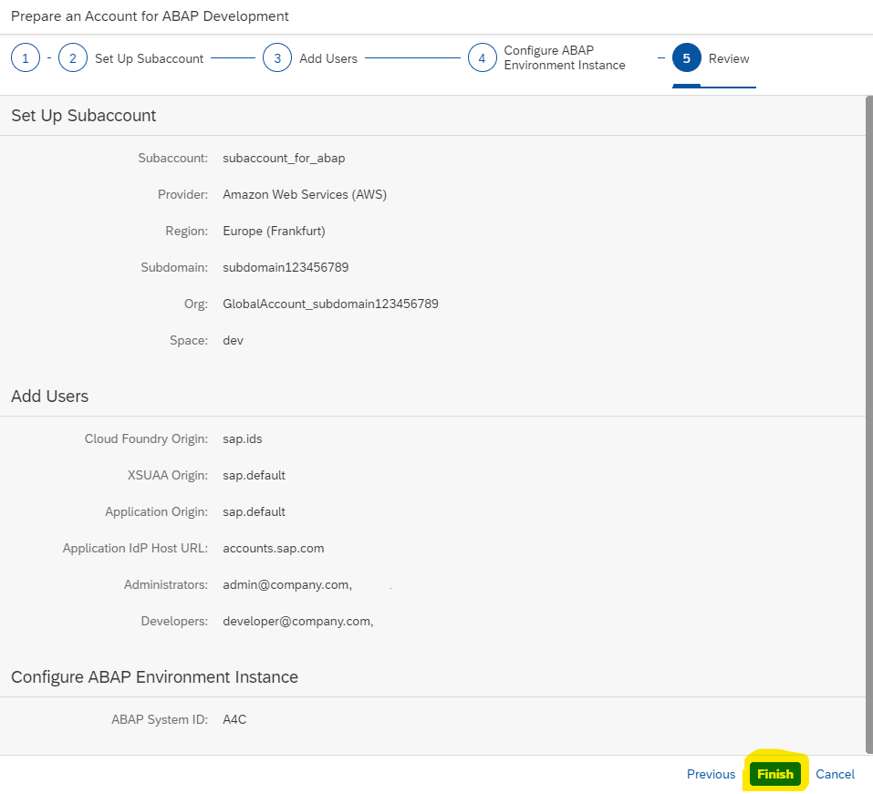

 

Press **"Finish"** and the booster will be executed.

    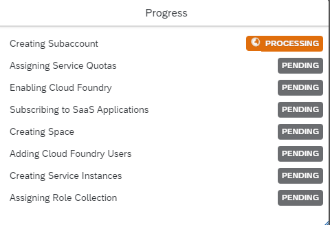

After the booster has executed successfully, you get a Success popup.  
Click on "Navigate to Subaccount".

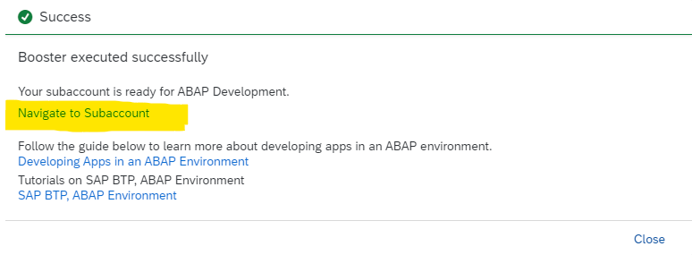

 

#### Navigate to your new Subaccount

1. In your new Subaccount Overview page, check the newly created configuration

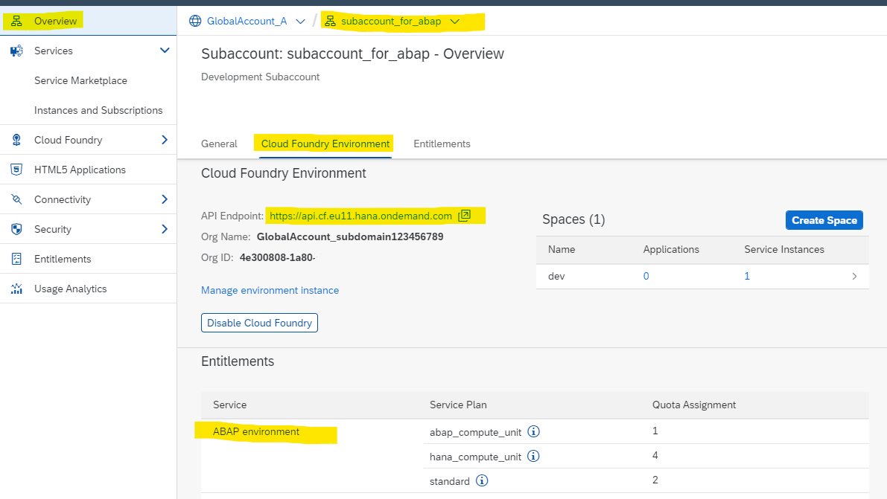

 

2. Goto to Instances and Subscriptions in the left handed navigation pane:

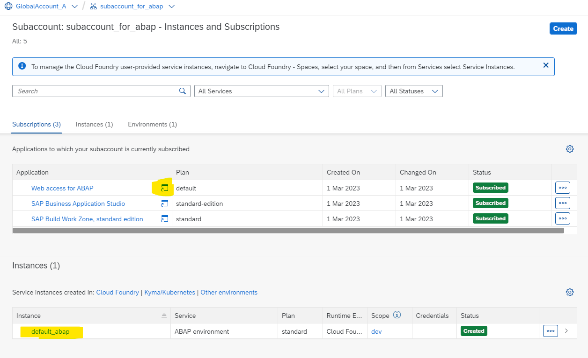

3. From here you can check your Web Access for ABAP
   You just get a success message. 

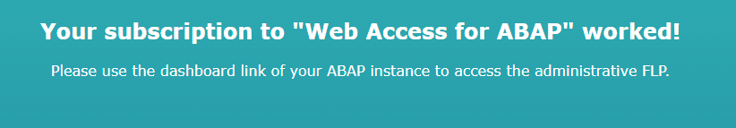

4. Discover your ABAP Admin Dashboard
   Browse the dashboard to become familiar. The tutorial ends here. You will use the dashboard in advanced tutorials or missions.

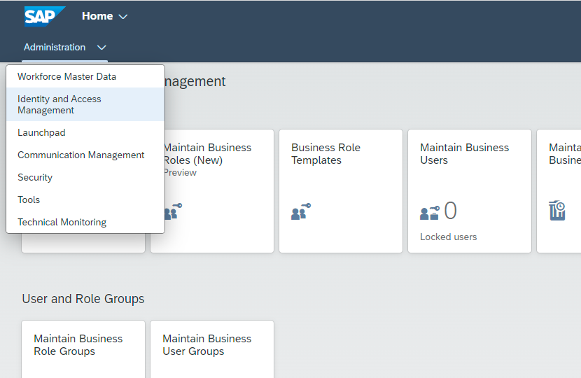

 

After completion, the subaccount can be accessed for further configuration and development.

 
