# Create an ABAP Environment manually

For the ABAP environment, you need a Cloud Foundry subaccount as a technical environment. 
The provider and region of the  Cloud Foundry subaccount must support provisioning an ABAP environment.
For more information see SAP Discovery Center [Service Plan](https://discovery-center.cloud.sap/serviceCatalog/abap-environment?region=all&tab=service_plan) for SAP BTP, ABAP environment.

**Procedure**

### Create Subaccount

1. Log on to your **Global Account**.
2. From your global account, choose `Create` --> **Subaccount**.

   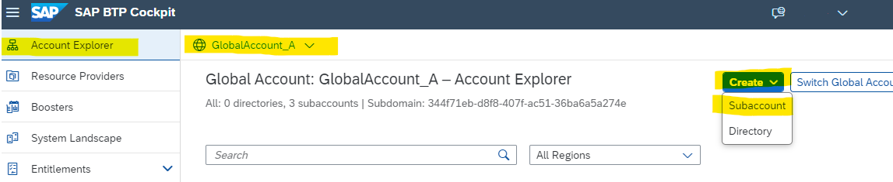

3. A popup iwndow opens. Provide the following entries:
   * Display Name: for example, subaccount_abap_manual.
   * Description: optional.
   * Region: Defines the infrastructure provider and the region for your subaccount, which provides ABAP.
   * Subdomain: Name of choice. 
     The subdomain will become part of the URL for accessing applications that you subscribe to from this subaccount. 
   You can choose any string of your choice, containing only letters, digits and hyphens.
   * Do not check "Used for production" in Advanced Settings   

    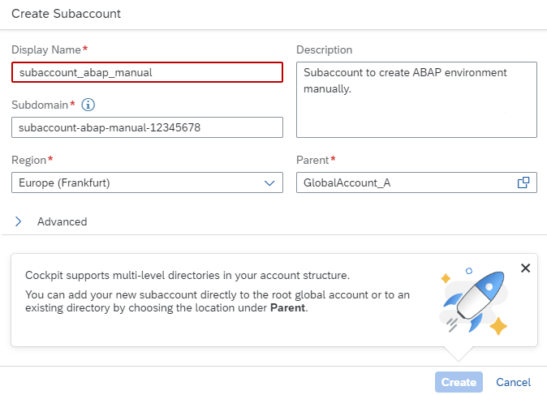

4. Choose `Create`.

 

### Enable Cloud Foundry

1. Enter your subaccount as administrator (if you created the subaccount, you have been auto-assigned as administrator)
2. Select Cloud Foundry Environment in the tabbed naviagtion and choose `Enable Cloud Foundry`.

   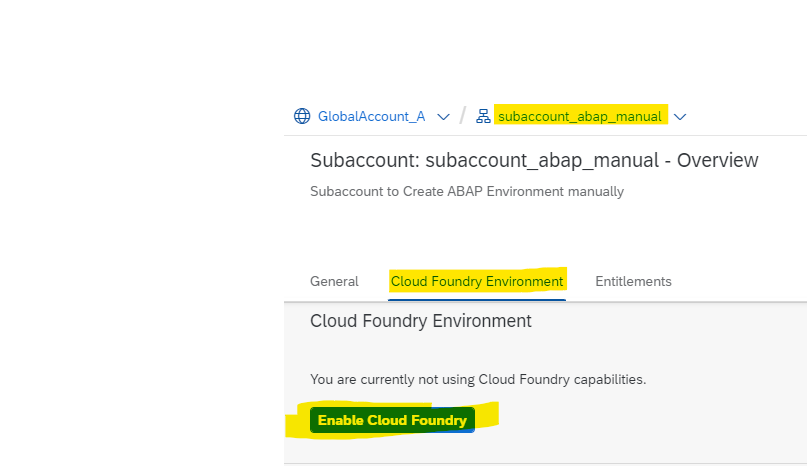

3. Keep the preconfigured entries:
   * Plan: standard is preconfigured
   * Landscape: Landscape of your subaccount is preconfigured
   * Instance Name: keep the entry or choose sth. CLI-friendly of your choice
   * Org Name: The Cloud Foundry Org Name. There is one per subaccount

4. Choose `Create`.     
5. The org will be created and Cloud Foundry will be enabled.

 

 ### Create a DEV Space

 If you created a new Cloud Foundry Environment, the **Spaces** will be empty. You need at least one.

 1. Choose button `Create Space` 
 2. Provide a Sapce Name, for example: **dev** 
 3. Keep the space roles.

   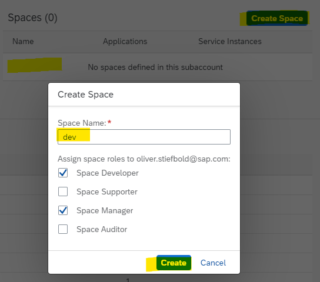

 4. Choose `Create`.
 5. A space, called **dev** will be created.

 

### Increase Quota for your ABAP Environment 

If you are working in an enterprise account, you need to add quotas in your subaccount to the services you are entitled to in your Global Account.  
Afterwards they appear in the **Service Marketplace** of your **subaccount** and you can use the services in your subaccount by subscribing to them.

1. Go to your global account.
2. From the navigation area, choose **Entitlements --> Entity Assignments**.
3. Select the subaccount for the ABAP environment and choose `Select`.

   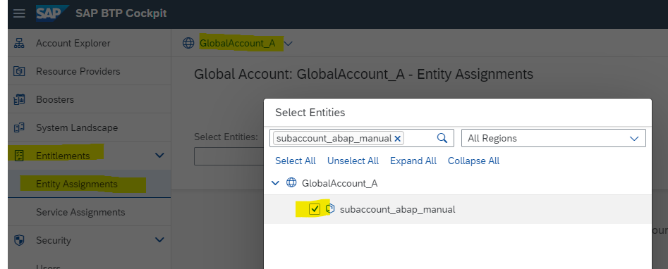

4. Choose `Configure Entitlements`.
5. Choose `Add Service Plans`.
   In the following popup, the available entitlements for this subaccount are shown.
   For the ABAP environment entitlement, select the plans abap_compute_unit, standard, and hana_compute_unit.
   Choose `Add 3 Service Plans` (or continue with Web Access for ABAP).

   

6. Choose `Save`. 

   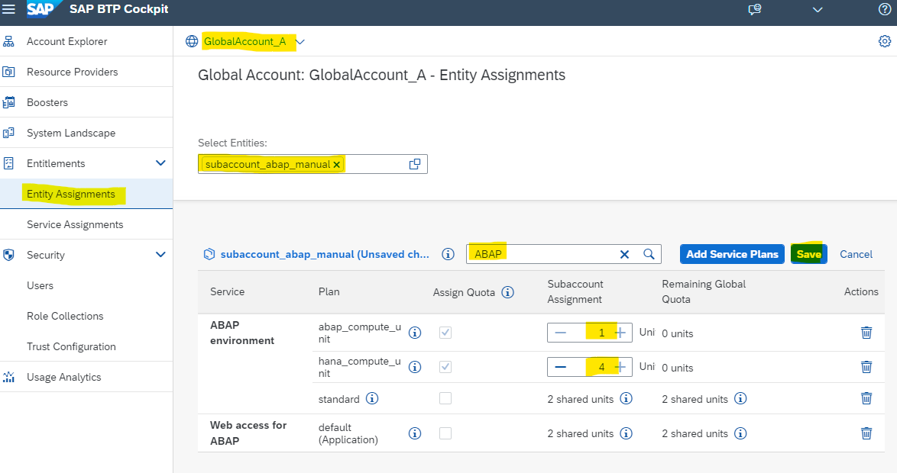

 

### Increase Quota for ABAP Web Access

The Web Access for ABAP  is required to access the SAP Fiori launchpad for the administrator and to access developed SAP Fiori applications.

1. Go to your global account.
2. From the navigation area, choose Entitlements --> Entity Assignments.
3. Enter the subaccount for the ABAP environment and choose `Select`.
4. Choose Configure Entitlements.
5. Choose Add Service Plans.
   For the Web Access for ABAP entitlement, select the plan default (Application).
   Choose `Add 1 Service Plan` (or continue with Cloud Foundry Runtime).

   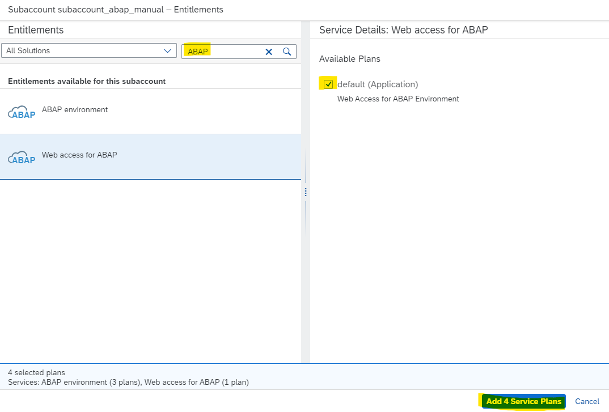

7. Choose `Save`. 

### Increase Quota for the Cloud Foundry Runtime (Optional)

A quota for the Cloud Foundry runtime is optional. It's only needed for the ABAP environment if your developers want to deploy their own apps in Cloud Foundry.

1. Go to your global account.
2. From the navigation area, choose Entitlements --> Entity Assignments.
3. Enter the subaccount for the ABAP environment and choose `Select`.
4. Choose Configure Entitlements.
5. Choose Add Service Plans.
6. In the following popup, proceed as follows:
   Choose Cloud Foundry Runtime.
   Under Available Service Plans, select the checkbox MEMORY.
   Choose `Add 1 Service Plan`.
7. Choose `Save`. 

 

### Create an ABAP System

Create a service instance for the ABAP environment from the Service Marketplace.

**Procedure**

1. Log on to the SAP BTP cockpit and navigate to your Cloud Foundry subaccount. 
2. From the navigation area, choose Services  Service Marketplace.
   You see a list of all services that are available to you.

   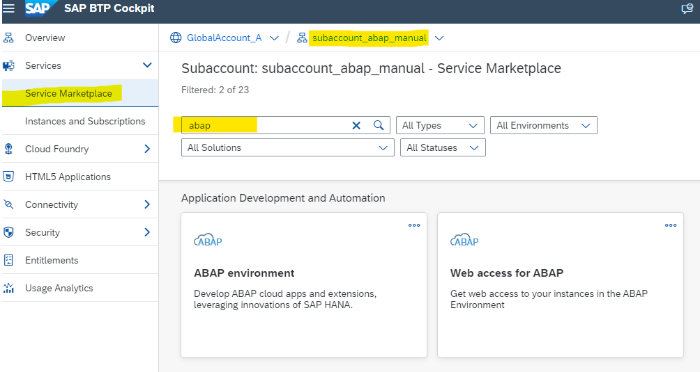

3. Choose ABAP environment.
4. Choose Create.
   A wizard opens that helps you create your instance.

   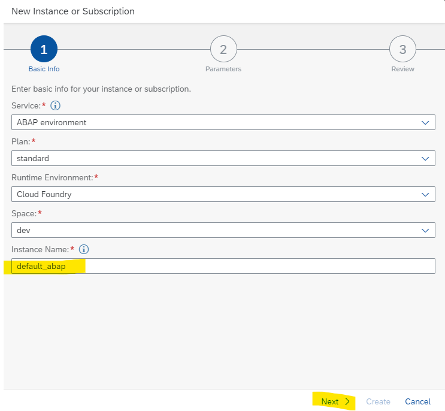

5. Select the standard service plan.
6. Choose Cloud Foundry as your runtime environment.
7. Select a space name, e.g. **dev**.
8. Enter a CLI-friendly instance name, common is **default_abap**.
9. Choose **Next**.
10. Provide additional instance parameters for the configuration.
    You use the default form in this tutorial.
    * Admin Email Address: take yours.
    * Development System checkbox: Is checked by default. Keep it in training environment.
    * ABAP system ID: Must consist of exactly three alphanumeric characters
    * ABAP runtime size: Minimum 1 
    * HANA memory size: Minimum 2 (4 recommended)

    Make sure that you don't choose more compute units than you have assigned to your subaccount for the ABAP environment

    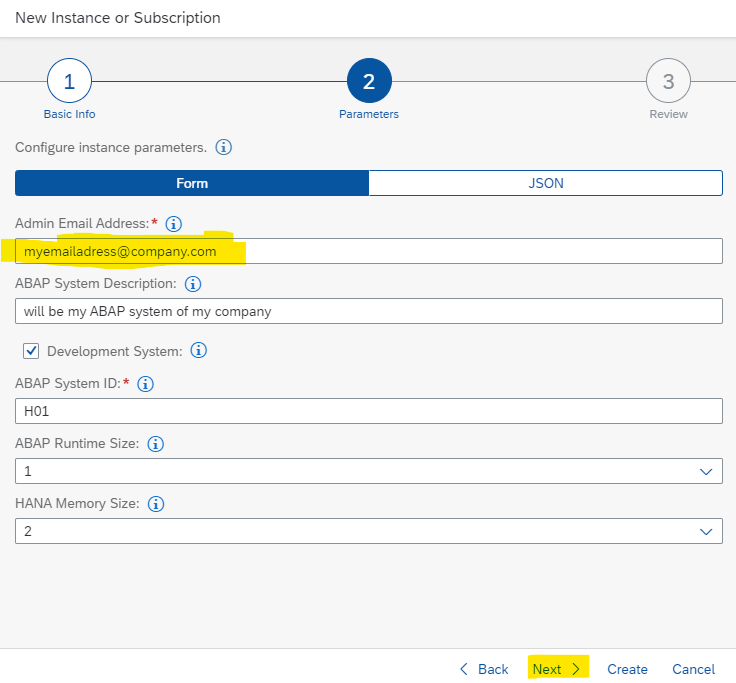

10. Choose Next to review and verify your instance details.

    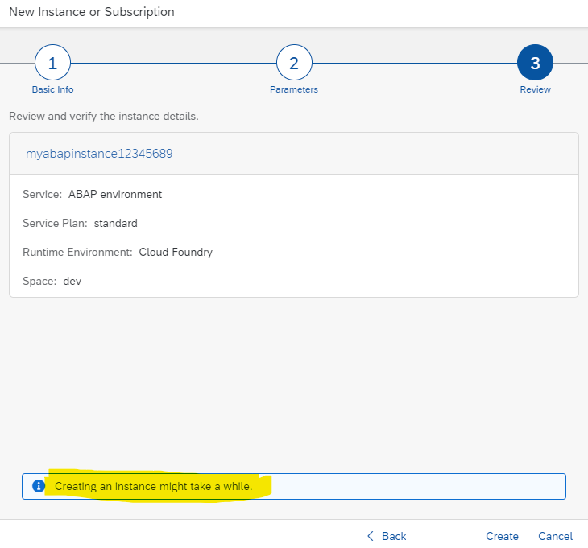

11. Choose Create.

    The ABAP environment instance is being set up, which might take a while.   
    Wait for an email that is sent when the setup is completed and the system up and running. 

    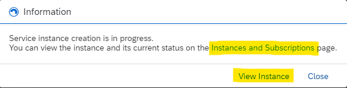

12. Click **Instances and Subsciptions** to see the progress.

    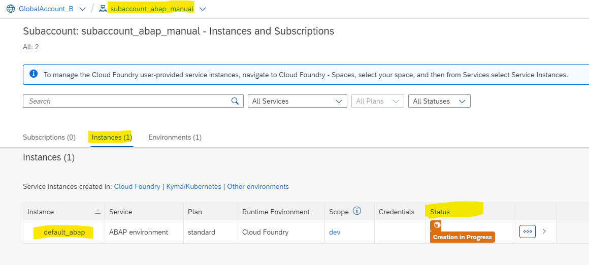

13. Once done (after a while), click your **instance name**, in this case **default_abap**.
    Note: Subsctibed **Applications** is still empty.
    
    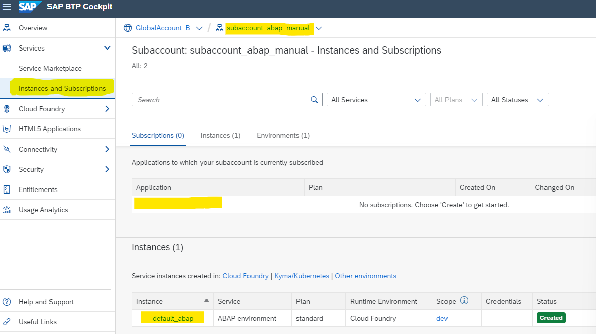

14. You will receive an error message, because you did not yet subscribe to the ABAP Web Access.

    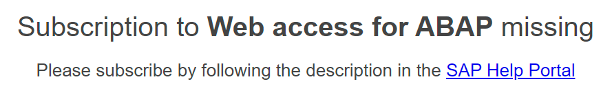

     

### Subscribing to the Web Access for ABAP

This subscription is required to access the launchpad for the ABAP administrator and to access developed SAP Fiori applications. Subscription is required only once per subaccount.

**Procedure**

1. Log on to the SAP BTP cockpit in the Cloud Foundry subaccount in which your un ABAP.
2. In the navigation area, choose **Services --> Service Marketplace**.
3. Choose the SaaS application tile Web access for ABAP.
4. Choose `Create`.
5. A popup windows opens. Keep the defaults. Choose Create.
   
   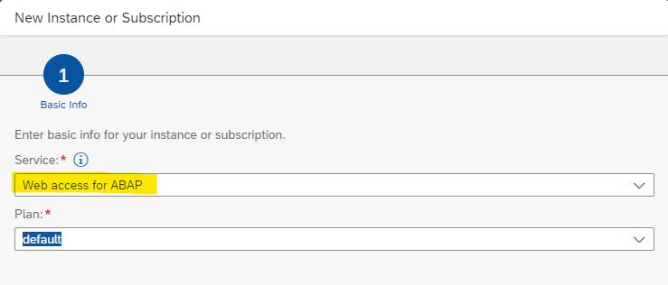

6. Wait for the subscription to be provisioned. Navigate to **Instances and Subscriptions**.  
   A new subscription for "Web access for ABAP" has been created.  
   Click on it. You just get a success message.

   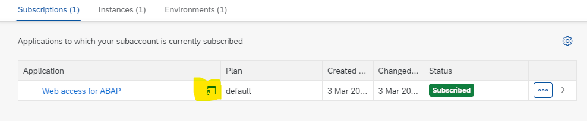

7. Scroll down and click your instance **default_abap** again.  
   The ABAP administrator launchpad opens. Browse the apps of the launchpad.  
   Using the ABAP administrator launchpad is part of advanced ABAP tutorials.

   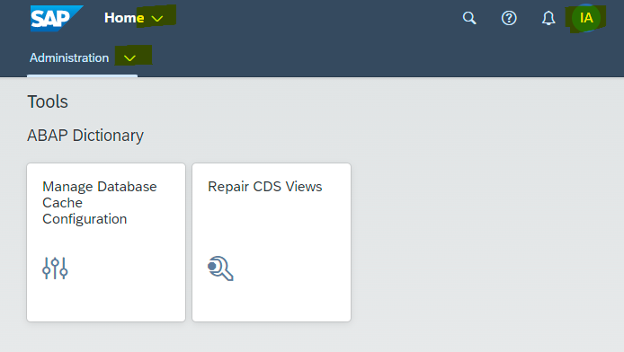

Congratulations! You have succesfully setup the ABAP Environment manually. 
For using it in development scenarios, please refer to related tutorials and missions e.g. on [Discovery Center](https://discovery-center.cloud.sap/serviceCatalog/abap-environment?tab=mission&region=all) or on [SAP Tutorials for Developers](https://developers.sap.com/tutorial-navigator.html?search=ABAP&tag=tutorial%3Atype%2Fmission).