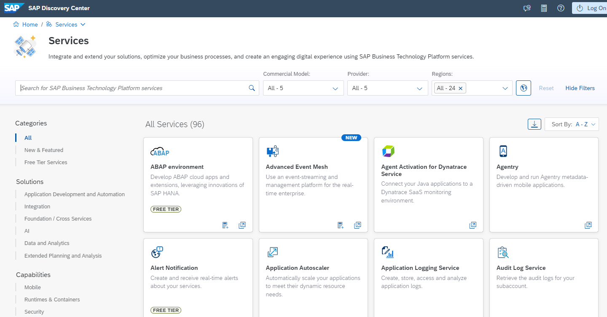
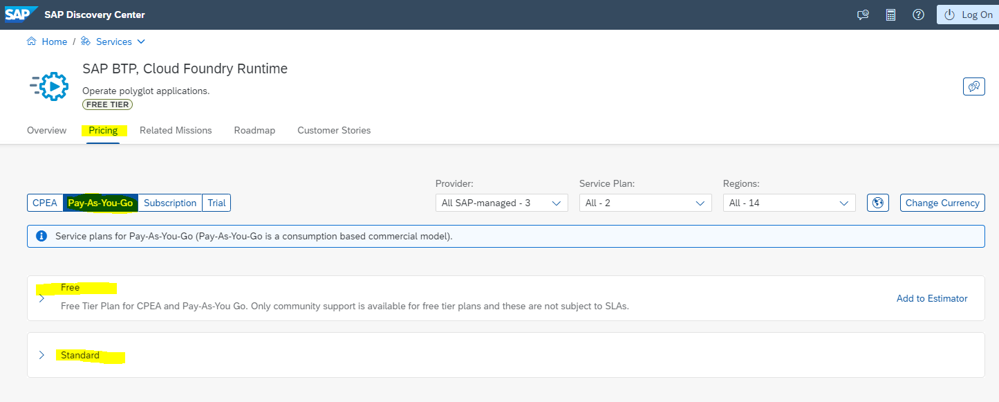

## Discover Services on SAP Discovery Center

### Service Catalog

Available SAP BTP services are listed in the [Discovery Center Service Catalog](https://discovery-center.cloud.sap/serviceCatalog?provider=all&regions=all&showFilters=true). 

 

 

If you select a service you can find under the tab **Pricing** information about

- the available commercial models for each service
- Service Plans for the commercial model and if e.g. free tier services plans are available or not
- Regions (data centers locations) and provider where you can provision them and
- the Metric how the consumption of the service is measured

 

 

### Estimator Tool
Important to note, you also have an option to add all the services to the estimator tool to get a glimpse of the overall charges of the services that you may use for your projects. 
The charges/prices are applicable for every service that is activated in your global account/subaccounts.

