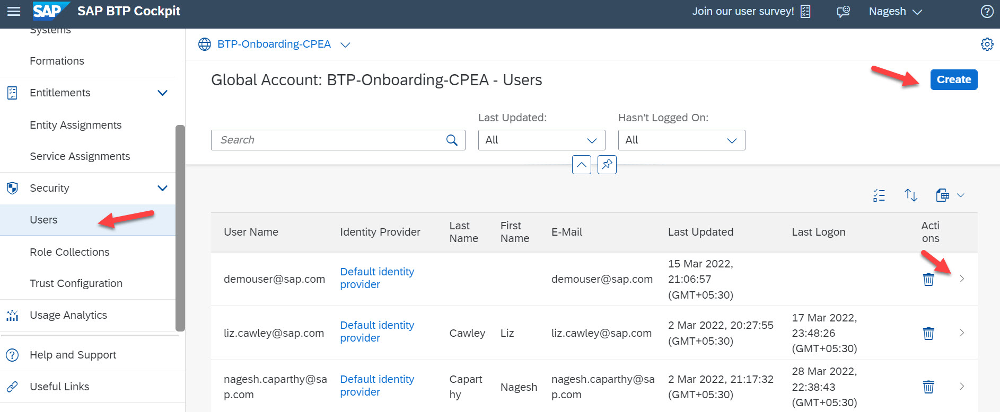

## Add Additional Global Account Members

As Global Account Administrator you can add additional users as global account members using the SAP BTP cockpit.

**Note:** SAP recommends that you create **at least one additional Global Account Administrator** who can support or substitute 
the initial Global Account Administrator if necessary. SAP cannot assign additional user IDs on your company's behalf.

**Note:** All global account members have global account administrator permissions for the global account. 
Adding members to global accounts is only possible in enterprise accounts, not in trial accounts.

### Procedure

1. Choose the global account to which you'd like to add members.
2. In the navigation area, choose Security and Users.
3. Choose "Create".
4. Enter one or more e-mail addresses, separated by commas, spaces, semicolons, or line breaks. The users you add as members at the global account level are automatically assigned the Administrator role.
5. You may check the assigned "Roles" under "Role Collections".

 

 

To get an overall understanding of your BTP Global Account Cockpit, look at the blog SAP BTP Cockpit – Global Account Technical Overview).
For more information, see SAP Help Portal [Add Members to Your Global Account](help.sap.com/docs/BTP/65de2977205c403bbc107264b8eccf4b/add-members-to-your-global-account?locale=en-US).

