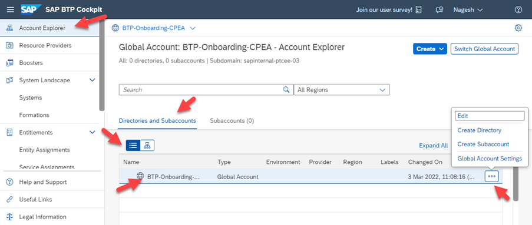

## Change the Display Name of Your Global Account

Members of the global account can change the name of the global account.

### Procedure

1. In the Account Explorer view, click on Directories and Subaccounts, select the table view and then select the global account for which you'd like to change the display name and select the "Edit"-pencil on its tile towards the right of the screen
2. A new dialog shows up with the mandatory Display Name field that is to be changed
3. Enter the name of your choice and save your changes

