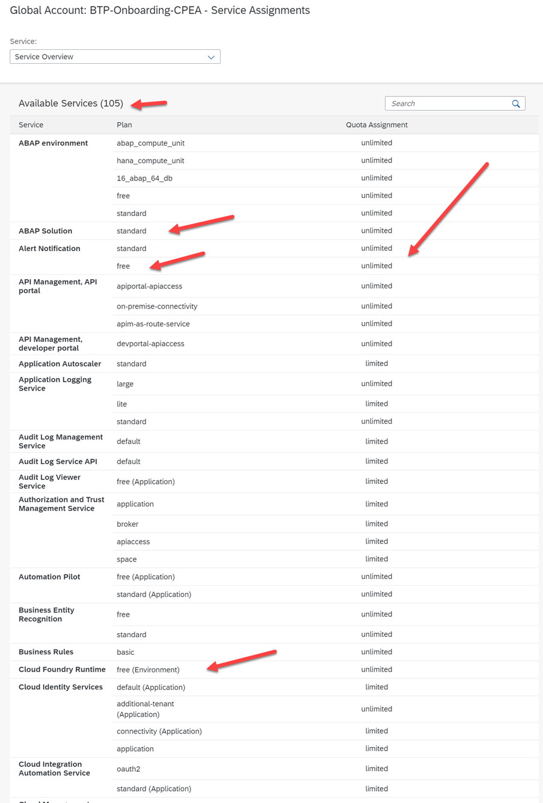
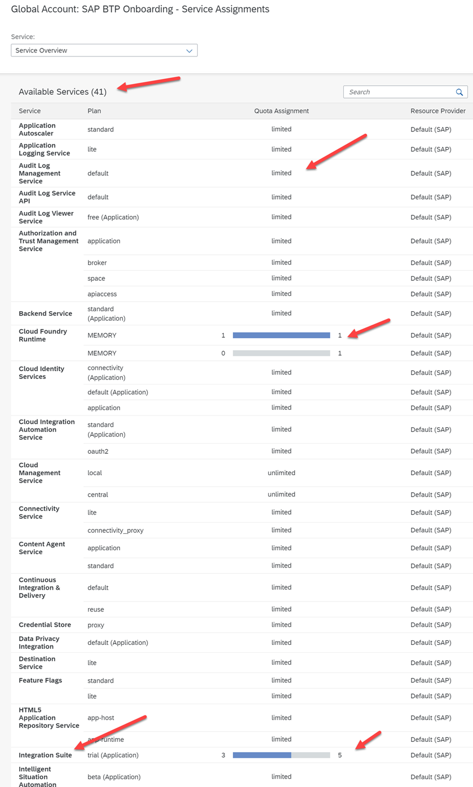

## Check your Entitlements for the Global Account

When you purchase an enterprise account, you are entitled to use a specific set of resources, such as the amount of memory that can be allocated to your applications. In a Consumption or PAYG Account, you have access to pretty much all the services that are available with an unlimited quota, in case you are on a subscription model, you will be able to see the services and their limits based on your license model. 

An **entitlement** is your right to provision and consumes a resource. In other words, entitlements are the **service plans** that you're entitled to use.

A **quota** represents the numeric quantity that defines the maximum allowed consumption of a resource. In other words, how much of a service plan you're entitled to use (limits).

**SAP BTP Services** can be business services or technical services. You find all available services and solutions in the SAP Discovery Center.

The figure shows an example of available services in a global account CPEA Model:

 

 

The above images list all the 105 services and help us to identify the Standard cost vs free tier services with its quota of assignments (limited/unlimited).

**Note:** Each instance of services that you activate in your subaccount is considered individual and charged based on the pricing listed in [Discovery Center Services](https://discovery-center.cloud.sap/viewServices?).

The image below is an example of a subscription model:

 

 

To get an overall understanding of your **BTP Global Account Cockpit**, look at the blog [SAP BTP Cockpit – Global Account Technical Overview](https://blogs.sap.com/2022/01/04/sap-btp-onboarding-series-sap-btp-cockpit-global-account-technical-overview/).
