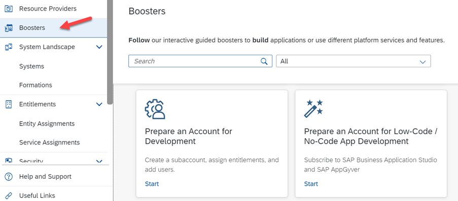
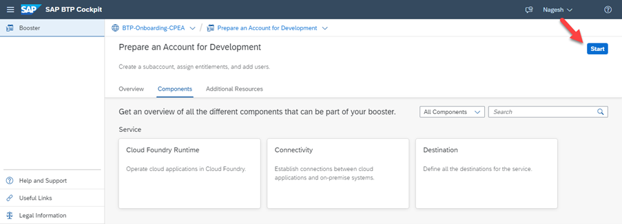
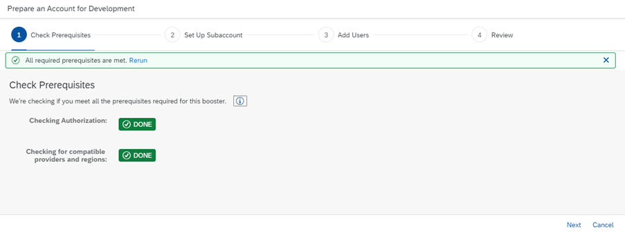
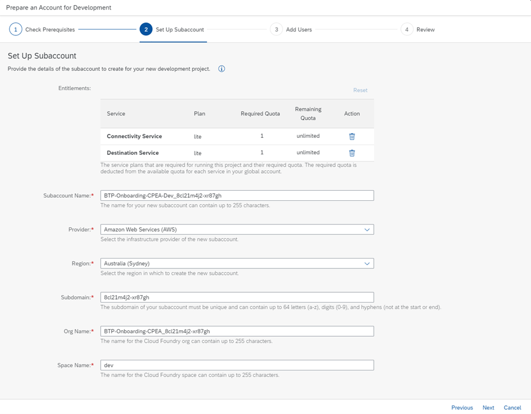
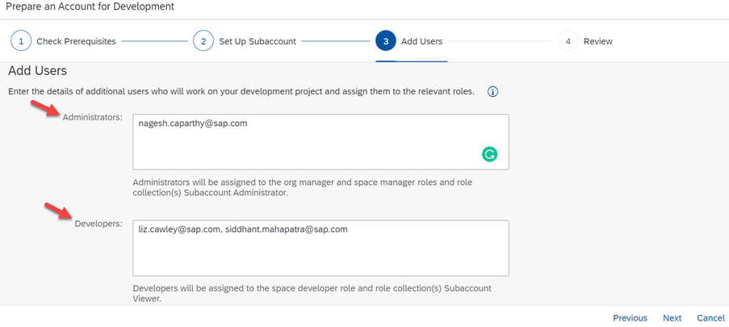
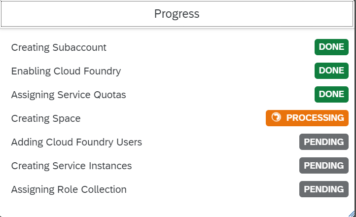
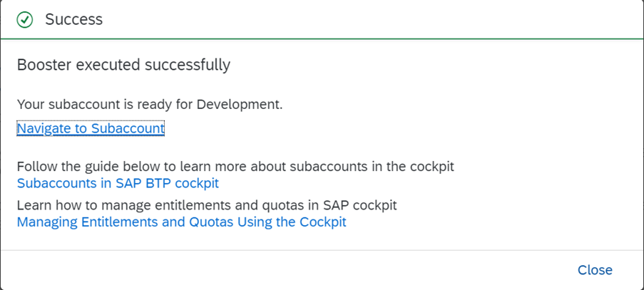

## Use Booster for creating a Cloud Foundry Subaccount

### Access Boosters in Cloud Cockpit

While you are getting started, an administrator needs to set up your subaccount for development activities. 
These activities could be achieved manually, however, BTP offers automation on the standard approach known as **“Booster”**.  
A booster is a wizard-based step-by-step BTP cockpit UI for achieving defined tasks in configuration.

You can find boosters under the navigation entry "boosters" in your global account.
 

 

### Choose Booster "Prepare an Account for Development”

In this mission, we are using the booster "Prepare an Account for Development” which helps you to create a Cloud Foundry subaccount for developing applications. Step by step, the booster assigns a curated set of entitlements, creates a subaccount, configures services, and sets up authorizations. In the background, it enables Cloud Foundry, creates default space, and assigns users to specific roles.

In the boosters overview, select the booster "Prepare an Account for Development", read the "Overview" description, and check the required "components". Entitlement of "Cloud Foundry Runtime" is required, which means your Global Account is entitled to use Cloud Foundry runtime. 

Press **"Start"** to start the booster.
 

 

### Fill out the Booster form

#### Step 1 - Check Prerequisites

The prerequisites will be checked and marked as green - authorizations and entitlements are fulfilled. Click "Next" to continue.

#### Step 2 - Set Up Subaccount

Provide

Subaccount name of your choice
Provider. Note: Only multi-cloud providers support Cloud Foundry runtime. SAP Data Center cannot be selected.
Region. Typically near your location
Subdomain. Note: Subdomain name is used as URL access and it cannot be changed once created.
Org name of your choice
and Space name (typically DEV, Test, or PROD)
and then click on "Next". 

#### Step 3 - Add Users

Provide subaccount admin users and the developers who will be accessing the system. Click on Next.

#### Step 4 - Review

Check the summary of the subaccount details before you execute the booster.

Press **"Finish"** and the booster will be executed.

 You should be able to see that your booster is executed successfully.
 
 

 After completion, the subaccount can be accessed for further configuration and development.
 
