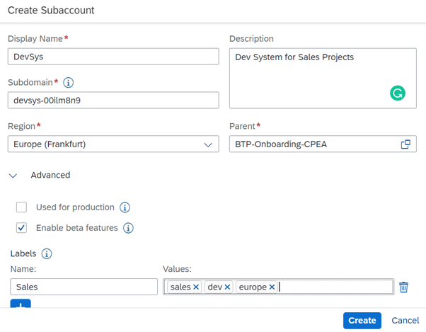

## Create Subaccounts manually

Creating a subaccount can be one of the easy tasks, however, one has to keep in mind the Hosting region, Naming conventions, Account Model, Labels, Authorizations, etc...

Before you start creating your subaccounts, we recommend understanding the basic details in this blog - [SAP BTP Cockpit – Global Account Technical Overview](https://blogs.sap.com/2022/01/04/sap-btp-onboarding-series-sap-btp-cockpit-global-account-technical-overview/) - section 3 and if you want to know about the account models and directories, you can read - [How to Determine your Account Model](https://blogs.sap.com/2021/12/17/sap-btp-onboarding-series-how-to-determine-your-account-model/).

### Now let us take a look at the details on creating the Subaccount manually.

1. From your global account, Click on Create, choose Subaccount
2. Specify a display name
3. (Optional) Specify a description
4. Select the region, environment, and infrastructure provider of the new subaccount according to your account plan. 
Additional fields appear according to the selected environment. Select settings as required.
**Note:** In a subaccount in the Cloud Foundry environment, the subdomain that you specify can be any string. The subdomain can contain only lowercase letters and digits, and hyphens (not allowed in the beginning or at the end) and must be unique within the Cloud Foundry environment of SAP BTP. 

5. (Optional) To use beta features in the subaccount, select Enable beta features.
6. Save your changes.

### Results

A new tile appears on the Global Account page with the subaccount details.

For more information see SAP Help Portal, [Create a Subaccounts](https://help.sap.com/docs/btp/sap-business-technology-platform/create-subaccount).
 

### Additional Information - Account Model

Within your region-independent global account, you can create any number of subaccounts in any environment and region, depending on your contract. 

For example, if you're located in the US, you can create subaccounts in different regions, such as Europe (Rot) or Japan (Tokyo), to support the customers who are using your applications. Subaccounts are independent of each other, which means that each subaccount allows for dedicated quota and member management. You can configure a dedicated identity provider for business users in each subaccount. 

Each subaccount is associated with exactly one environment, Cloud Foundry for example.

### Decisions for subaccounts:

**Environment:** One environment per subaccount  Cloud Foundry environment (recommended), ABAP, Kyma or NEO environment
**Region:** Choose the region and infrastructure provider of your choice. For limitations see [Discovery Center Services](https://discovery-center.cloud.sap/serviceCatalog?showFilters=true).

### Typical Setup

A typical setup for a BTP environment is the Staged Development Environment with DEV, TEST, and PROD landscape for each project.

Create one subaccount in Cloud Foundry and 3 cloud foundry spaces for dev, test, and prod.
In the NEO environment use 3 subaccounts for dev, test, and prod, typically in one Global Account.
For more information, see SAP Help - [Setting Up Your Account Model](https://help.sap.com/docs/btp/best-practices/setting-up-your-account-model?locale=en-US).
 
**Note:** You cannot create subaccounts in a trial account.

 
