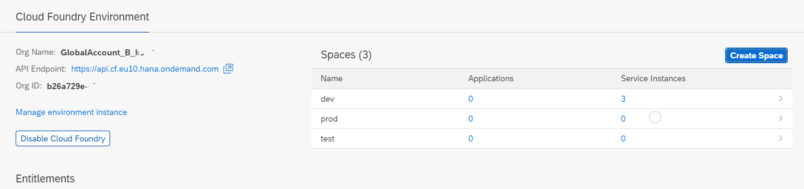

## Create Organizations and Spaces manually

Organizations and Spaces are only available in Cloud Foundry sub-accounts.
The booster has already created one organization and one space for the Cloud Foundry subaccount.
Each subaccount can contain only one Cloud Foundry org. There is no limit to how many spaces you can have within one org.
Spaces e.g. can be used to seperate dev from testing and prod environment.

### Create an Organization manually

For each Cloud Foundry subaccount you need to create one organization (1:1 relationship). You can do this also manually:

1. Check the button "Enable Cloud Foundry".
2. Enable if disabled.
3. Provide a name for the organization.

For more information see [Org Administration Using the Cockpit](https://help.sap.com/docs/BTP/65de2977205c403bbc107264b8eccf4b/org-administration-using-cockpit?locale=en-US)

### Creating Spaces

Once you have an organization, you can create a space (1:n relationship, one is usually already created by the booster):

1. In the BTP cockpit navigation menu, choose Spaces.
2. Press the button "Create Space"
3. Provide a name  (choose "dev" if you have no name)

 

For more information, see [Managing Spaces](https://help.sap.com/docs/BTP/65de2977205c403bbc107264b8eccf4b/managing-spaces?locale=en-US) on SAP Help Portal.

