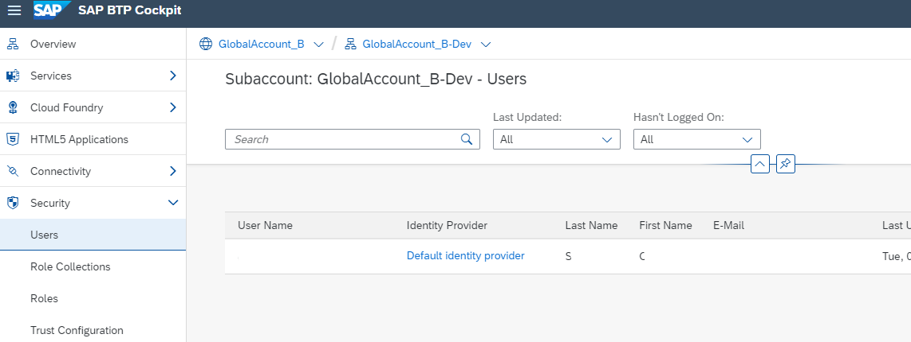

## Add Members to Subaccount

### SAP ID Service
The default SAP BTP identity provider and application identity provider of SAP BTP is the SAP ID service. 
Trust to SAP ID service in your subaccount is pre-configured by default, so you can start using it without further configuration. 

For more information about SAP ID Service see [SAP Help Portal](https://help.sap.com/docs/BTP/65de2977205c403bbc107264b8eccf4b/default-identity-provider?locale=en-US).

For more information, or on how to establish trust with your custom identity provider, start the mission [Establish single sign-on to your cloud solutions](https://discovery-center.cloud.sap/missiondetail/3114/3151/).
 

### Users
If you want to grant authorizations to users from the SAP ID service in your subaccount, you must ensure that they have a user account in the SAP ID service.
For more information see [Working with Users](https://help.sap.com/docs/btp/sap-business-technology-platform/working-with-users). 
 

### Roles and Role Collections
Roles determine which functions in the cockpit users can view and access, and which actions they can initiate.
SAP BTP offers predefined "Role Collections", which are sufficient for this mission.
For more information see [Working with Role Collections](https://help.sap.com/docs/btp/sap-business-technology-platform/working-with-role-collections)). 
 

### Add Users in Subaccounts and assign Role Collections in Cloud Foundry
1. Open the SAP BTP cockpit.
2. Choose the subaccount to which you'd like to add users.
3. In the navigation pane, choose "Security" and then "Users".

4. All members currently assigned to the subaccount are shown in a list.
5. Choose `Create`.
6. Enter the user ID and e-mail address.
7. Choose the identity provider where the user is stored. The dropdown list displays the identity providers configured in the trust configuration of your subaccount.
8. `Save` your changes.

You can now proceed to assign role collections to the new user. Browse the list of available Role Collections by clicking on "Role Collections".

### Appendix: Context Neo
For more information on the Neo environment, see [Managing Member Authorizations in the NeoEnvironment Using the Cockpit](https://help.sap.com/docs/BTP/ea72206b834e4ace9cd834feed6c0e09/managing-member-authorizations-in-neo-environment).
